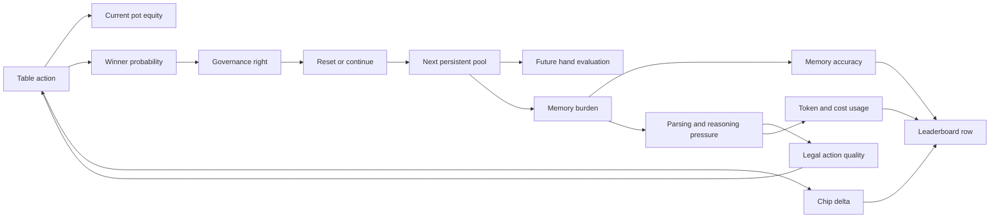

# Current Game-Theoretic Framework of PersistentPoker-Bench

This document describes the game-theoretic structure already present in
PersistentPoker-Bench before adding any new strategic mechanisms.

It is intentionally different from
[`horse_v2_topological_rules.md`](./horse_v2_topological_rules.md). The
topological rules document formalizes the rule space, state topology, and
variant transitions. This document instead treats the benchmark as a strategic
object: payoff, strategy, path dependence, memory, reset/continue governance,
leaderboard objectives, bounded rationality, and equilibrium notions.

The current system is not merely poker plus a memory test. It is a finite
seeded stochastic game with imperfect information, endogenous public memory,
conditional governance rights, model-compliance constraints, and a multi-axis
benchmark payoff.

## 1. Snapshot of the Current Game

At the current implementation level, a benchmark run is a tournament composed
of matches, and each match is a sequence of poker hands. A hand may be
ordinary Hold'em or part of a H.O.R.S.E.-style rotation. Across hands, a public
persistent pool carries exposed cards forward unless a winning player chooses
to reset it.

The central strategic twist is:

```text
winning a hand gives chips now and a conditional right to shape the next state.
```

The winner is not only paid. The winner may also choose whether the public
memory environment remains complex or is cleared.

Thus each decision simultaneously participates in:

1. a poker subgame over chips,
2. a memory-accuracy subgame over the reported persistent pool,
3. a public-state governance subgame over reset versus continue,
4. a benchmark-compliance subgame over parseability and schema adherence,
5. a resource-efficiency subgame over tokens, cost, latency, and robustness.

The game is therefore not zero-sum in the benchmark objective, even though
chips are primarily transferred among players.

## 2. Basic Mathematical Object

Let

\[
N=\{1,\ldots,n\}
\]

be the set of seats. A match consists of hands

\[
h \in \{1,\ldots,H\},
\]

unless a termination rule stops earlier.

The current benchmark can be represented as an extensive-form stochastic game

\[
\mathcal{G}_{current}
=
\left(
N,
\mathcal{X},
\mathcal{A},
\mathcal{D},
\mathcal{T},
\mathcal{O},
\mathcal{U},
\mathcal{M},
\mathcal{L}
\right),
\]

where:

| Symbol | Meaning |
|---|---|
| \(N\) | players/models/seats |
| \(\mathcal{X}\) | full engine state space |
| \(\mathcal{A}\) | legal poker action space |
| \(\mathcal{D}\) | decision-envelope space returned by an agent |
| \(\mathcal{T}\) | transition kernel induced by rules, RNG seed, actions, and reset choice |
| \(\mathcal{O}_i\) | observation function for player \(i\) |
| \(\mathcal{U}_i\) | benchmark utility/payoff vector for player \(i\) |
| \(\mathcal{M}\) | memory-evaluation operator |
| \(\mathcal{L}\) | leaderboard aggregation and ranking functional |

Because cards and stacks are finite, and because bet amounts are integer
bounded by stack sizes, the finite-hand version is a finite extensive-form
game with imperfect information. The survival variants are also finite under
the current safety cap, even when the intended mode is marathon-like.

## 3. Full State

At decision time \(t\) inside hand \(h\), write the full engine state as

\[
x_{h,t}
=
\left(
v_h,
b_h,
r_{h,t},
s_{h,t},
c_{h,t},
q_{h,t},
z_{h,t},
P_h,
\omega_h,
\beta_h
\right).
\]

The components are:

| Component | Meaning |
|---|---|
| \(v_h\) | current variant, e.g. Hold'em, Omaha 8B, Razz, Stud, Stud 8B |
| \(b_h\) | button / positional state |
| \(r_{h,t}\) | street or betting round |
| \(s_{h,t}\) | stack vector |
| \(c_{h,t}\) | committed chips, pot, side-pot-relevant quantities |
| \(q_{h,t}\) | per-player status: folded, all-in, eliminated, pending actor |
| \(z_{h,t}\) | dealt cards, partitioned into private, public board, up-cards, down-cards |
| \(P_h\) | persistent public pool at start of hand \(h\) |
| \(\omega_h\) | deterministic seed stream / chance realization |
| \(\beta_h\) | budget, usage, or run-level metadata relevant to benchmark constraints |

The most important non-standard component is \(P_h\).

## 4. Persistent Pool as Public Memory

Let \(\mathcal{C}\) be the 52-card deck. The persistent pool is a finite
multiset of cards:

\[
P_h \in \mathbb{N}^{\mathcal{C}}.
\]

Equivalently, \(P_h\) lives in the free commutative monoid generated by cards:

\[
(\mathbb{N}^{\mathcal{C}}, +, 0).
\]

The multiplicity of a card \(c\) is:

\[
P_h(c) \in \mathbb{N}.
\]

Duplicates matter. This is why the decision schema asks the model to preserve
duplicates in `believed_pool`.

The size of the pool is:

\[
|P_h|_1 = \sum_{c \in \mathcal{C}} P_h(c).
\]

The pool acts as public state in the engine, but as cognitive load for an LLM.
The engine knows the pool exactly. A model may not.

## 5. Observation and Belief

Player \(i\)'s observation at decision node \((h,t)\) is:

\[
o_{i,h,t}
=
O_i(x_{h,t}).
\]

This contains:

| Observed | Description |
|---|---|
| public hand state | street, pot, visible board or up-cards, stacks, action context |
| private hand state | the model's hole/down cards |
| legal action summary | whether fold/check/call/bet/raise/all-in is legal and relevant amounts |
| persistent pool | public pool cards as serialized in the prompt |
| schema contract | the required JSON response format |
| variant instructions | extra rule text for H.O.R.S.E. variants |

The engine-level information set is the usual imperfect-information poker
object:

\[
I_i(h,t)=\{x \in \mathcal{X}: O_i(x)=o_{i,h,t}\}.
\]

But the benchmark introduces a second, model-internal belief object:

\[
\widehat{P}_{i,h,t}.
\]

This is the pool the model reports in `believed_pool`. It is not merely a
belief for play. It is also an audited artifact.

The memory operator compares \(\widehat{P}_{i,h,t}\) to the true pool:

\[
\mathcal{M}(\widehat{P}_{i,h,t},P_h)
\to
\left(
exact,\ accuracy,\ missing,\ extra
\right).
\]

The implemented aggregate memory score is the average multiset accuracy over
decision events.

## 6. The Decision Envelope

The current LLM decision object is:

\[
d_{i,h,t}
=
\left(
a_{i,h,t},
m_{i,h,t},
\widehat{P}_{i,h,t},
\delta_{i,h,t},
\rho_{i,h,t}
\right).
\]

The fields correspond to:

| Field | Meaning |
|---|---|
| \(a_{i,h,t}\) | poker action: fold, check, call, bet, raise, all-in |
| \(m_{i,h,t}\) | amount, required for bet/raise |
| \(\widehat{P}_{i,h,t}\) | reported believed pool |
| \(\delta_{i,h,t}\) | conditional winner decision: reset or continue |
| \(\rho_{i,h,t}\) | optional reasoning note, currently not scored |

The unusual point is that \(\delta_{i,h,t}\) is declared before knowing whether
it will matter. It is a conditional policy commitment:

\[
\delta_{i,h,t}
\in
\{\mathsf{reset},\mathsf{continue}\}.
\]

Only winners can cause that declaration to become effective.

## 7. Table Actions

The table action space at node \((h,t)\) is:

\[
A_i(x_{h,t})
\subseteq
\{\mathsf{fold},\mathsf{check},\mathsf{call},
\mathsf{bet},\mathsf{raise},\mathsf{all\_in}\}
\times \mathbb{N}.
\]

Legal actions are state-dependent. The engine normalizes or falls back when
an agent response cannot be parsed or made legal. Therefore a submitted
decision has two layers:

\[
d_{i,h,t}^{raw}
\xrightarrow{parser}
d_{i,h,t}^{parsed}
\xrightarrow{legalizer}
a_{i,h,t}^{engine}.
\]

The strategic consequence is important: a model can have a strong intended
strategy and still lose benchmark value through non-compliance.

## 8. Pool Governance

At the end of a hand, the engine identifies the winner set:

\[
W_h \subseteq N.
\]

Let \(E_h\) be the exposed-card multiset appended to the persistent pool by
the hand:

\[
P_h^+ = P_h + E_h.
\]

For Hold'em-style hands, \(E_h\) is the public board. For current H.O.R.S.E.
hands, flop-game board cards and stud-style up-cards may be added, depending
on the variant-specific hand state.

The effective pool decision is:

\[
\delta_h
=
\Gamma
\left(
W_h,\{\delta_{i,h,t}:i \in W_h,\ t \in T_h\}
\right),
\]

where \(\Gamma\) is the implemented winner-decision resolver.

Current behavior:

1. if no showdown winner exists, continue;
2. if no winner decision exists, continue;
3. if all winning players agree, use that decision;
4. if winners disagree, select among winner declarations with the deterministic
   tiebreaker.

The next pool is:

\[
P_{h+1}
=
\begin{cases}
0, & \delta_h=\mathsf{reset},\\
P_h^+, & \delta_h=\mathsf{continue}.
\end{cases}
\]

This is the central governance operator of the game.

## 9. Hand-to-Hand Transition

Let \(S_h\) be the vector of starting stacks for hand \(h\), and let
\(\Pi_h\) be the payout vector after betting and showdown/fold resolution.

At hand scale:

\[
S_{h+1}=S_h+\Pi_h-B_h,
\]

where \(B_h\) denotes chips committed into pots during the hand, represented
internally through player commitments and pot allocation.

The transition from hand \(h\) to hand \(h+1\) is therefore:

\[
\left(S_h,P_h,b_h,v_h\right)
\xrightarrow{actions,\ chance,\ showdown,\ \delta_h}
\left(S_{h+1},P_{h+1},b_{h+1},v_{h+1}\right).
\]

The key point is that \(\delta_h\) changes the future state without directly
changing current chips.

## 10. Strategy Space

A pure strategy for player \(i\) is a function from private histories to
decision envelopes:

\[
\sigma_i:
\mathcal{H}_i
\to
\mathcal{D}_i.
\]

Here \(\mathcal{H}_i\) includes every observation and private card event seen
by player \(i\), including previous prompts, previous actions, previous pool
states, and previous parse outcomes if available to the model architecture.

A mixed strategy is:

\[
\sigma_i:
\mathcal{H}_i
\to
\Delta(\mathcal{D}_i).
\]

For LLM agents, the practical strategy is more accurately:

\[
\sigma_i^{LLM}
=
F_{\theta_i,p_i,\tau_i,\kappa_i}
\left(
o_{i,h,t}
\right),
\]

where:

| Symbol | Meaning |
|---|---|
| \(\theta_i\) | model weights / provider implementation |
| \(p_i\) | prompt and schema |
| \(\tau_i\) | sampling, temperature, decoding settings |
| \(\kappa_i\) | parser, retry, budget, and adapter behavior |

This makes the benchmark a contest among model-policy systems, not only among
abstract poker policies.

## 11. Policy Has Four Simultaneous Outputs

Every non-terminal model decision can be decomposed into four strategic
outputs:

\[
\sigma_i(o)
=
\left(
\sigma_i^{chip}(o),
\sigma_i^{memory}(o),
\sigma_i^{governance}(o),
\sigma_i^{format}(o)
\right).
\]

These correspond to:

| Component | Output |
|---|---|
| chip policy | fold/check/call/bet/raise/all-in and amount |
| memory policy | reported \(\widehat{P}\) |
| governance policy | reset/continue conditional declaration |
| format policy | ability to satisfy exact JSON and legal-action constraints |

A strong model must do all four at once. This is why the benchmark exposes
failure modes that ordinary poker EV does not expose.

## 12. Payoff Vector

The benchmark payoff for player \(i\) is not scalar by default. It is a vector:

\[
U_i
=
\left(
U_i^{chips},
U_i^{final},
U_i^{survival},
U_i^{win},
U_i^{memory},
U_i^{parse},
U_i^{pool},
U_i^{usage}
\right).
\]

Implemented aggregate metrics include:

| Metric | Symbol | Description |
|---|---|---|
| chip delta | \(U_i^{chips}\) | final stack minus initial stack |
| final stack | \(U_i^{final}\) | ending chip stack |
| survival | \(U_i^{survival}\) | final stack greater than zero |
| win rate | \(U_i^{win}\) | fraction of hands won |
| memory accuracy | \(U_i^{memory}\) | average multiset pool accuracy |
| parsing success | \(U_i^{parse}\) | fraction of parseable decision events |
| reset rate | \(U_i^{reset}\) | frequency of reset declarations/events |
| average pool size | \(U^{pool}\) | average post-hand pool size |
| usage | \(U_i^{usage}\) | input tokens, output tokens, cached tokens, estimated cost |

Some are individual payoffs. Some are match-level environmental statistics.
Together they form the score surface of the benchmark.

## 13. Leaderboard Functional

The current leaderboard row aggregates metrics by provider/model. Rows are
sorted by the following priority order:

\[
\mathcal{L}(i)
=
lex
\left(
\overline{\Delta chips}_i,
\overline{final\ stack}_i,
survival_i,
win_i,
memory_i,
-cost_i,
name_i
\right).
\]

More explicitly, higher is better for:

1. average chip delta;
2. average final stack;
3. survival rate;
4. win rate;
5. memory accuracy.

Lower is better for estimated total cost once the preceding metrics tie.

This means the leaderboard is not optimizing pure hand win rate. A model can
win many hands while losing chips, and therefore rank poorly. This is already
visible in the efficiency-track interpretation: passive calling can inflate
hand participation or occasional wins while destroying stack EV.

## 14. Chip Game Versus Benchmark Game

Let the pure poker chip objective be:

\[
V_i^{chip}
=
\mathbb{E}[S_{i,H+1}-S_{i,1}].
\]

The benchmark objective is closer to:

\[
V_i^{bench}
=
\Phi
\left(
V_i^{chip},
V_i^{survival},
V_i^{memory},
V_i^{parse},
V_i^{usage},
V^{pool}
\right),
\]

where \(\Phi\) is induced by metrics, leaderboard sorting, and track-specific
interpretation.

The result is a game where:

```text
best poker move != best benchmark move
```

in some states.

Examples:

| Situation | Poker-only pressure | Benchmark pressure |
|---|---|---|
| marginal call with huge context | call if chip EV positive | fold may preserve stack and reduce future error exposure |
| verbose reasoning | improve local calculation | may break strict JSON or increase cost |
| winner with large pool | continue if pool helps future hand strength | reset if cognitive load harms memory and decisions |
| short stack in survival | take chip-positive gamble | avoid bankruptcy if survival dominates |

## 15. Intertwined Payoff Graph

The current game can be read as a causal graph:



The loop is the point. Pool complexity changes future cognition; future
cognition changes action quality; action quality changes who controls the
pool.

## 16. The Persistent Pool as Strategic Externality

The persistent pool creates an externality. If a winner chooses continue,
every surviving player inherits:

\[
P_{h+1}=P_h+E_h.
\]

That continuation may benefit the winner, but it also changes the
computational environment of opponents.

Let \(K(P)\) be a cognitive-complexity functional. Simple choices include:

\[
K_1(P)=|P|_1,
\]

\[
K_2(P)=|\{c:P(c)>0\}|,
\]

\[
K_3(P)=\sum_{c\in\mathcal{C}} \log(1+P(c)).
\]

A bounded model may have error probability:

\[
\Pr(error_i \mid P)
=
f_i(K(P),v_h,o_{i,h,t}),
\]

with \(f_i\) generally increasing in \(K(P)\).

Then continuing the pool imposes:

\[
Externality_{i\to j}
=
\mathbb{E}
\left[
V_j(P_h+E_h)-V_j(0)
\right].
\]

This externality may be positive for a model that uses the pool well and
negative for a model that collapses under context load.

## 17. Reset as a Real Option

A reset choice is not merely a cleanup action. It is a real option acquired by
winning.

Define the continuation value for player \(i\):

\[
C_i(P_h,E_h,H_h)
=
\mathbb{E}
\left[
V_i(H_{h+1},P_h+E_h)
-
V_i(H_{h+1},0)
\mid H_h
\right].
\]

The rational winner continues iff:

\[
C_i(P_h,E_h,H_h) \ge 0.
\]

The rational winner resets iff:

\[
C_i(P_h,E_h,H_h) < 0.
\]

In a bounded-cognition benchmark, decompose:

\[
V_i(H,P)
=
V_i^{chip}(H,P)
\alpha_i V_i^{memory}(H,P)
\beta_i V_i^{survival}(H,P)
-\lambda_i K_i(P)
-\mu_i Cost_i(H,P).
\]

Then reset is favored when:

\[
\lambda_i
\left[
K_i(P_h+E_h)-K_i(0)
\right]
+
\mu_i
\left[
Cost_i(H_{h+1},P_h+E_h)-Cost_i(H_{h+1},0)
\right]
\]

exceeds the expected chip and information benefit of keeping the pool.

This formalizes the observed "metacognitive reset" tactic.

## 18. Continue as Weaponization

Continue can be rational even when it increases complexity. In fact, that may
be the point.

If model \(i\) has lower memory-error sensitivity than opponents, then:

\[
f_i(K(P)) < f_j(K(P))
\quad
\text{for most } j \ne i.
\]

In that case, increasing \(K(P)\) can create an advantage:

\[
Adv_i(P)
=
\sum_{j\ne i}
\left[
f_j(K(P))-f_i(K(P))
\right].
\]

The persistent pool becomes a strategic weapon:

```text
continue not because the pool is easy,
but because it is harder for everyone else.
```

This is one of the hidden game-theoretic components already present.

## 19. Memory Report as Audited Type Signal

The reported `believed_pool` plays two roles:

1. it is evidence of whether the model tracks public state;
2. it is an implicit type signal about model robustness.

A model with high memory accuracy reveals that its internal state is close to
the public game state:

\[
\widehat{P}_{i,h,t} \approx P_h.
\]

A model with low memory accuracy is effectively playing a distorted game:

\[
\widehat{P}_{i,h,t} \ne P_h.
\]

That distortion can affect:

| Distortion | Consequence |
|---|---|
| missing cards | underestimates available hand combinations |
| extra cards | overestimates phantom blockers or phantom made hands |
| duplicate errors | misreads duplicate-aware evaluator strength |
| ordering-only confusion | usually harmless if multiset is preserved |

The benchmark measures the distance between the game the engine is running and
the game the model appears to believe it is running.

## 20. Parsing as Strategic Fragility

The strict JSON schema creates a compliance channel. Let

\[
\chi_{i,h,t}
=
\mathbf{1}
\{d_{i,h,t}^{raw}\text{ parses successfully}\}.
\]

The parse success metric is:

\[
Parse_i
=
\frac{1}{T_i}
\sum_{h,t}\chi_{i,h,t}.
\]

A failure in \(\chi\) can dominate a good strategic intention, because the
engine may need to use fallback behavior. This creates a benchmark-specific
tradeoff:

\[
ReasoningDepth_i
\uparrow
\quad \Rightarrow \quad
StrategicCalculation_i \uparrow
\quad \text{but possibly} \quad
ParseReliability_i \downarrow.
\]

This is not classical poker. It is agentic poker under protocol pressure.

## 21. Cost and Token Usage

For each decision event, provider usage may expose:

\[
tokens^{in}_{i,h,t},
tokens^{out}_{i,h,t},
tokens^{cached}_{i,h,t},
cost_{i,h,t}.
\]

Aggregate usage is:

\[
Cost_i
=
\sum_{h,t} cost_{i,h,t}.
\]

The current leaderboard uses cost after chip, stack, survival, win rate, and
memory accuracy in sort order. Therefore cost is not the primary objective,
but it matters as an efficiency discriminator and as an operational constraint
through budget caps.

Cost also interacts with strategy:

| More reasoning | Possible gain |
|---|---|
| longer internal computation | better rule adherence |
| larger output | better explanation but higher parse risk |
| higher context use | better pool tracking but higher spend |
| cached inputs | lower marginal cost if provider supports it |

The efficiency track makes this interaction especially visible.

## 22. Path Dependence

The match is path-dependent through at least five channels:

| Channel | State carried forward |
|---|---|
| chips | stacks and eliminations |
| position | button and live-seat rotation |
| pool | persistent public card multiset |
| model state | provider/model behavior under accumulated context |
| benchmark accounting | cost, token usage, parse history, metrics |

A path is:

\[
\tau
=
(x_{1,0},d_{1},x_{1,1},\ldots,x_{H,T_H}).
\]

The final utility is not a sum of independent hands:

\[
U_i(\tau)
\ne
\sum_h u_i(x_h,d_h)
\]

unless \(u_i\) is augmented to include all continuation-state effects.

Early hands can dominate later outcomes because they determine:

1. who has stack leverage;
2. whether the pool becomes large;
3. which models experience memory degradation;
4. whether weak models are eliminated before their long-run policy matters;
5. which variant regimes are reached with which stacks and pool state.

## 23. Markovian Engine, Non-Markovian Agent

From the engine perspective, the game is Markov if the full state \(x_{h,t}\)
is included:

\[
\Pr(x_{h,t+1}\mid x_{\le h,t},d_{\le h,t})
=
\Pr(x_{h,t+1}\mid x_{h,t},d_{h,t}).
\]

From the model perspective, play may be non-Markovian because:

1. the model may compress or forget earlier pool entries;
2. the prompt may not contain every latent provider state;
3. previous failures can alter future behavior through context or adapter state;
4. the model may form narratives about opponents across hands.

Thus the engine has a clean Markov state, but agents may implement
history-dependent approximations.

## 24. H.O.R.S.E. Rotation as Regime Switching

Let the variant process be:

\[
v_h = R(h).
\]

In H.O.R.S.E. mode, \(R\) cycles through variant regimes. Each regime changes:

1. what cards matter;
2. whether high or low is good;
3. which cards are public;
4. how the persistent pool interacts with showdown;
5. which rule text the model must follow.

The strategy must therefore be:

\[
\sigma_i(o,v_h,P_h),
\]

not merely:

\[
\sigma_i(o,P_h).
\]

The same pool can have different strategic meaning in different variants.
For example, a card that helps high-hand evaluation may be irrelevant or
harmful under lowball reasoning. This creates rule-switching pressure.

## 25. Survival and Infernal/Marathon Regimes

The official registry currently has `frontier` and `efficiency` tracks. The
repository also contains harsher long-run or survival-style configurations,
including infernal/marathon naming and first-bankrupt termination.

A fixed-hand match emphasizes expected chip accumulation:

\[
\max \mathbb{E}[S_{i,H+1}-S_{i,1}].
\]

A first-bankrupt survival match emphasizes avoiding an absorbing failure state:

\[
\min \Pr(\exists h: S_{i,h}\le 0).
\]

These are not equivalent. A positive-EV high-variance policy may be desirable
in a fixed horizon and undesirable under first-bankrupt scoring.

Thus the same model can be strategically strong in frontier mode, efficient in
ROI mode, and fragile in infernal survival mode.

## 26. Zero-Sum and Non-Zero-Sum Layers

The chip layer is approximately redistributive:

\[
\sum_i S_{i,h}
\approx
\sum_i S_{i,1},
\]

ignoring implementation details of allocation, all-in handling, and terminal
conditions.

The benchmark layer is not zero-sum:

| Layer | Zero-sum? | Reason |
|---|---|---|
| chips | mostly yes | one player's chip gain comes from others |
| survival | no | multiple players may survive fixed horizon |
| memory accuracy | no | all models can be accurate or inaccurate |
| parsing | no | all models can comply |
| cost | no | total spend can vary independently of chips |
| pool size | public environmental statistic | affects all players jointly |

This matters because equilibrium in chip EV may not be equilibrium in
benchmark utility.

## 27. Candidate Scalarizations

Although the benchmark stores a vector, analysis often requires a scalar.
Useful scalarizations include:

\[
J_i^{chip}= \mathbb{E}[\Delta S_i],
\]

\[
J_i^{survival}= \Pr(S_{i,H+1}>0),
\]

\[
J_i^{memory}= \mathbb{E}[Memory_i],
\]

\[
J_i^{efficiency}
=
\frac{\mathbb{E}[\Delta S_i]}{\epsilon+\mathbb{E}[Cost_i]},
\]

\[
J_i^{robust}
=
\mathbb{E}[\Delta S_i]
-\lambda_1 \Pr(ParseFail_i)
-\lambda_2 \mathbb{E}[1-Memory_i]
-\lambda_3 \mathbb{E}[Cost_i].
\]

A more faithful leaderboard scalarization is lexicographic rather than linear:

\[
J_i^{LB}
=
lex
\left(
\Delta S_i,
S_{i,H+1},
Survival_i,
Win_i,
Memory_i,
-Cost_i
\right).
\]

The choice of scalarization changes the apparent optimum.

## 28. Optimal Policy

For a chosen scalar objective \(J_i\), an optimal policy satisfies:

\[
\sigma_i^\star
\in
\arg\max_{\sigma_i}
\mathbb{E}_{\sigma_i,\sigma_{-i},\omega}
\left[
J_i(\tau)
\right].
\]

Because all players are learning-free fixed agents during a run, a model's
best response is relative to a lineup:

\[
BR_i(\sigma_{-i})
=
\arg\max_{\sigma_i}
\mathbb{E}
\left[
J_i
\mid
\sigma_i,\sigma_{-i}
\right].
\]

The hard part is that \(\sigma_i\) must optimize:

1. local poker EV;
2. future pool governance;
3. memory accuracy;
4. parse compliance;
5. cost/resource behavior;
6. variant switching.

## 29. Dynamic Programming View

For a finite capped match, define a value function:

\[
V_i(x)
=
\max_{d_i\in D_i(x)}
\mathbb{E}
\left[
r_i(x,d_i,d_{-i})
+
\gamma V_i(x')
\right].
\]

This expression is conceptually valid but practically enormous because:

1. hidden-card state is large;
2. stack and bet amounts are many;
3. persistent pool multiplicities grow;
4. H.O.R.S.E. variants change evaluator semantics;
5. LLM policies are not transparent finite tables;
6. metrics are path-dependent and non-scalar by default.

The benchmark is therefore better understood as an empirical game-theoretic
testbed than as a game intended for closed-form solution.

## 30. Nash, Sequential, and Bounded Equilibria

Several equilibrium concepts apply.

### Nash equilibrium

A strategy profile \(\sigma^\star\) is Nash for scalar utility \(J_i\) if:

\[
J_i(\sigma_i^\star,\sigma_{-i}^\star)
\ge
J_i(\sigma_i,\sigma_{-i}^\star)
\quad
\forall i,\forall\sigma_i.
\]

### Subgame-perfect equilibrium

Because the game is extensive-form with observed public histories, a stronger
notion requires optimality after every public history.

### Perfect Bayesian / sequential equilibrium

Because cards are private, an equilibrium should include beliefs over hidden
state:

\[
\mu_i(x\mid o_i).
\]

Strategies must be sequentially rational given those beliefs.

### Markov-perfect equilibrium

If strategies depend only on the current full state or belief state, one can
study Markov-perfect equilibria:

\[
\sigma_i(o_{i,h,t})=\sigma_i(o_i(x_{h,t})).
\]

### Bounded-agent equilibrium

For LLMs, the most realistic notion is restricted:

\[
\sigma_i \in \Sigma_i^{model},
\]

where \(\Sigma_i^{model}\) is the policy class induced by a specific model,
prompt, parser, budget, and provider adapter.

Then a bounded equilibrium is:

\[
\sigma_i^\star
\in
\arg\max_{\sigma_i\in\Sigma_i^{model}}
J_i(\sigma_i,\sigma_{-i}^\star).
\]

This is the equilibrium concept most aligned with PersistentPoker-Bench.

## 31. Reset Threshold Model

A useful local model for reset behavior is threshold-based.

Let:

\[
B_i(P)
\]

be the informational benefit of the current pool to player \(i\), and:

\[
L_i(P)
\]

be the cognitive loss induced by the pool.

Continue iff:

\[
B_i(P_h+E_h)-L_i(P_h+E_h)
\ge
B_i(0)-L_i(0).
\]

Since \(B_i(0)=0\) for pool-specific information and \(L_i(0)\approx 0\),
this reduces to:

\[
B_i(P_h+E_h) \ge L_i(P_h+E_h).
\]

Different model families have different \(B_i\) and \(L_i\). This explains why
one model may rationally continue while another rationally resets in the same
state.

## 32. Pool Size Is Not Monotone Value

More public information is not always better for bounded agents.

Classically, additional public information cannot harm a perfectly rational
Bayesian agent that can ignore it. But an LLM is not costless and not perfectly
selective. It may be harmed by:

1. attention dilution;
2. duplicate tracking errors;
3. rule confusion;
4. output-format collapse;
5. longer prompts and higher latency/cost;
6. false confidence from misremembered cards.

Therefore:

\[
V_i(P)
\]

need not be monotone in \(|P|\).

It may have an interior optimum:

\[
|P|^\star_i
\in
\arg\max_k
\mathbb{E}[V_i(P): |P|=k].
\]

This is one of the benchmark's most important design features.

## 33. Strategic Archetypes Already Present

The current rules already permit several strategic archetypes.

| Archetype | Behavior | Game-theoretic interpretation |
|---|---|---|
| pool hoarder | almost always continue | values public history or overvalues information |
| metacognitive resetter | resets when pool becomes dangerous | optimizes bounded cognition |
| pool weaponizer | continues to overload weaker opponents | exploits asymmetric memory costs |
| survival nit | folds marginal spots | values non-bankruptcy over chip EV |
| calling station | calls too often | may win hands but lose stack EV |
| format maximalist | outputs minimal valid JSON | protects parse payoff |
| verbose reasoner | reasons richly but risks schema failure | trades calculation for compliance risk |
| variant specialist | performs well in some H.O.R.S.E. regimes | non-stationary policy quality |
| cost minimizer | uses short outputs or cheaper model track | optimizes efficiency layer |

These archetypes are emergent from the current framework, not proposed
extensions.

## 34. Opponent Modeling

A player can exploit not only opponents' poker tendencies, but also their
agentic weaknesses.

Let opponent \(j\)'s failure profile be:

\[
\theta_j^{fail}
=
\left(
f_j^{memory},
f_j^{parse},
f_j^{variant},
f_j^{risk},
f_j^{cost}
\right).
\]

Then player \(i\)'s optimal policy can condition on estimated weaknesses:

\[
\sigma_i^\star(o)
=
BR_i(o,\widehat{\theta}_{-i}^{fail}).
\]

Examples:

| Opponent weakness | Exploit |
|---|---|
| poor memory under large pool | continue after winning |
| JSON fragility under long context | extend pool and force complex states |
| lowball confusion | increase pressure during Razz |
| passive calling | value bet thinner |
| over-resetting | deny them pool-based hand strength |

This is still within the existing game.

## 35. Pool Governance as Signaling

The reset/continue declaration may signal a model's type:

\[
\delta_i \in \{\mathsf{reset},\mathsf{continue}\}
\]

can reveal:

1. confidence in memory;
2. belief that the pool is valuable;
3. fear of context overload;
4. opponent-targeting intent;
5. misunderstanding of the rule.

If future agents condition on observed reset behavior, then \(\delta_i\) is
not only a state-control action but also a public signal.

## 36. Winner Control and Incentive Coupling

The right to reset is coupled to winning. This creates an additional marginal
benefit of winning a hand:

\[
MB_i^{win}
=
MB_i^{chips}
+
MB_i^{governance}.
\]

where:

\[
MB_i^{governance}
=
\mathbb{E}
\left[
\max_{\delta\in\{reset,continue\}}
V_i(P_{h+1}^{\delta})
-
V_i(P_{h+1}^{default})
\right].
\]

This can make aggression more valuable than it appears in chip-only analysis,
because winning grants control over future cognitive terrain.

## 37. Multi-Winner Governance

When multiple winners split or tie, the reset/continue decision can become a
small collective-choice problem.

Let:

\[
W_h=\{i_1,\ldots,i_k\}.
\]

If all winners choose the same decision, that decision is applied. If they
disagree, the implemented tiebreaker selects among winner declarations.

This means governance is:

1. dictatorial when there is a single winner;
2. unanimous when co-winners agree;
3. randomized or tiebroken when co-winners conflict.

The strategic value of \(\delta_i\) is therefore weighted by the probability
of being in the effective control set.

## 38. Side Pots and Eligibility

For current Hold'em-style showdown, side pots are built from committed levels.
This makes chip payoff depend not only on having the best hand, but also on
eligibility:

\[
Eligible_i(pot_k)
\in
\{0,1\}.
\]

All-in decisions therefore alter:

1. maximum possible gain;
2. downside exposure;
3. which pots a player can win;
4. survival probability;
5. probability of earning governance rights.

The interaction between all-in pressure and pool governance is subtle: a short
stack may win a side pot and survive, while another player may win the main
allocation or be recognized in the winner set depending on the terminal
structure.

## 39. Variant Simplification as Framework Fact

The current H.O.R.S.E. implementation is an active benchmark engine rather
than a complete casino-faithful formalization. Some variant handling is
simplified relative to ideal H.O.R.S.E., especially around hi-lo nuance and
full split-pot semantics.

Game-theoretically, this matters because the true game is the implemented
transition function:

\[
\mathcal{T}_{implemented}
\ne
\mathcal{T}_{casino}.
\]

Optimal agents must play the implemented game, not the idealized game. This is
why documentation should distinguish:

1. intended rules;
2. implemented rules;
3. benchmark scoring rules.

The current topological rules document already marks that distinction; this
document treats the implemented benchmark as the payoff object.

## 40. Evaluation as Empirical Game Theory

Each tournament run samples a strategy profile:

\[
(\sigma_1,\ldots,\sigma_n)
\]

under deterministic seeds and fixed configs. The output estimates:

\[
\widehat{U}_i
=
\frac{1}{R}
\sum_{r=1}^R
U_i(\tau_r).
\]

Because the model policies are black-box and stochastic, the benchmark is
closer to empirical game-theoretic analysis than symbolic game solving.

Repeated seeded runs allow:

1. variance estimation;
2. matchup matrices;
3. track-specific rankings;
4. ablation of pool behavior;
5. analysis of reset thresholds;
6. analysis of parse/memory fragility.

## 41. Frontier, Efficiency, and Infernal Interpretations

The same formal game supports different interpretive regimes.

### Frontier

Primary question:

```text
Which strongest model-policy system wins the richest strategic environment?
```

Frontier emphasizes strategic competence, rule following, and long-context
reasoning under pressure.

### Efficiency

Primary question:

```text
Which model converts cost into benchmark performance most effectively?
```

Efficiency emphasizes lower spend, lower verbosity, parse reliability, and
ROI-like behavior. It exposes cases where a cheaper or shorter-output model
plays a better benchmark policy than a larger model.

### Infernal / marathon / diabolical survival

Primary question:

```text
Which model survives compounding path dependence and cognitive toxicity?
```

This regime emphasizes endurance, bankruptcy avoidance, reset discipline,
variant switching, and resistance to persistent-pool overload.

## 42. Current Hidden Game-Theoretic Components

The current framework already contains hidden components that are easy to
miss if one only sees "poker benchmark".

| Component | Why it matters |
|---|---|
| conditional governance | winning controls future public memory |
| endogenous complexity | players can increase or clear future cognitive load |
| asymmetric bounded rationality | pool size hurts models unequally |
| public memory externality | reset/continue affects everyone |
| audited belief | `believed_pool` turns internal state into measured output |
| parse fragility | invalid JSON can dominate strategic intent |
| lexicographic scoring | win rate is subordinate to chip delta and survival |
| variant switching | optimal policy changes by regime |
| path-dependent survival | early errors reshape the whole match |
| cost accounting | model quality is entangled with resource use |

These are already enough to make the benchmark strategically rich.

## 43. What an "Optimum" Means Here

There is no single optimum until we specify the objective.

Possible optima:

| Optimum | Definition |
|---|---|
| chip optimum | maximizes expected chip delta |
| survival optimum | maximizes probability of not busting |
| leaderboard optimum | maximizes lexicographic benchmark rank |
| memory optimum | maximizes pool-tracking accuracy |
| efficiency optimum | maximizes performance per cost |
| robust optimum | performs well under variant switching and long pool paths |
| exploitative optimum | best response to a known model lineup |
| minimax optimum | maximizes worst-case performance across opponents |

These can conflict. For example:

\[
\sigma_i^{chip\star}
\ne
\sigma_i^{survival\star}
\ne
\sigma_i^{efficiency\star}.
\]

The benchmark is interesting precisely because these optima pull in different
directions.

## 44. Research Questions Already Testable

Without adding new mechanics, the current game can already test:

1. Does reset rate predict long-run survival?
2. Is there a pool-size threshold where memory accuracy collapses?
3. Which models benefit from continue, and which are harmed?
4. Does H.O.R.S.E. rotation increase parse failure or only strategic error?
5. Does lower output verbosity improve benchmark rank?
6. Are efficiency models more robust because they reason less verbosely?
7. Does chip aggression increase governance control enough to justify risk?
8. Does win rate negatively correlate with chip delta for calling-station models?
9. Which variants produce the most catastrophic rule drift?
10. Does initial pool seeding change the identity of the best model?

These are not hypothetical extensions. They are measurable with existing run
artifacts and current metrics.

## 45. Implementation Correspondence

The formal objects above correspond to concrete source modules:

| Formal object | Implementation surface |
|---|---|
| player/model registry | `src/persistentpoker_bench/model_registry.py` |
| decision envelope \(d_i\) | `src/persistentpoker_bench/schemas.py` |
| prompt/observation payload | `src/persistentpoker_bench/prompting.py` |
| persistent pool \(P_h\) | `src/persistentpoker_bench/pool.py` |
| hand transition | `src/persistentpoker_bench/hand_runner.py` |
| match transition/path | `src/persistentpoker_bench/match_runner.py` |
| H.O.R.S.E. visible-card update | `src/persistentpoker_bench/horse/horse_runner.py` |
| showdown and side pots | `src/persistentpoker_bench/showdown.py` |
| memory metric | `src/persistentpoker_bench/memory_check.py` |
| aggregate payoff vector | `src/persistentpoker_bench/metrics.py` |
| leaderboard functional | `src/persistentpoker_bench/leaderboard.py` |
| budget constraints | `src/persistentpoker_bench/budget.py` |
| tournament sampling | `src/persistentpoker_bench/tournament.py` |
| replay/video observability | `src/persistentpoker_bench/replay.py`, `src/persistentpoker_bench/video_renderer.py` |

This map is important because the game-theoretic object is not an abstract
proposal. It is already distributed across the engine, schema, metrics,
leaderboard, and visualization layers.

## 46. Minimal Formal Summary

The current benchmark can be compressed into the following system:

\[
d_{i,h,t}
=
\sigma_i
\left(
O_i(x_{h,t})
\right),
\]

\[
x_{h,t+1}
\sim
\mathcal{T}
\left(
x_{h,t},d_{i,h,t},d_{-i,h,t},\omega
\right),
\]

\[
P_{h+1}
=
\begin{cases}
0, & \Gamma(W_h,\delta_W)=\mathsf{reset},\\
P_h+E_h, & \Gamma(W_h,\delta_W)=\mathsf{continue},
\end{cases}
\]

\[
U_i
=
\left(
\Delta S_i,
S_{i,H+1},
Survival_i,
WinRate_i,
Memory_i,
Parse_i,
Cost_i
\right),
\]

\[
Rank
=
\mathcal{L}(U_i).
\]

The defining non-standard loop is:

\[
action
\to
winner
\to
pool\ governance
\to
future\ memory\ complexity
\to
future\ action.
\]

That loop is the heart of PersistentPoker-Bench.

## 47. Design Interpretation

PersistentPoker-Bench currently tests a model's ability to act under a nested
strategic burden:

1. play the local poker hand;
2. remember and report the persistent public multiset;
3. understand when memory is useful versus toxic;
4. choose reset or continue as a future-state control;
5. survive variant shifts;
6. remain parseable under strict schema constraints;
7. achieve all of the above at acceptable cost.

The persistent pool turns public information into a dynamic resource. The
reset/continue choice turns victory into governance. The leaderboard turns
poker success into a multi-objective benchmark. Together these elements create
an intertwined payoff landscape where optimum play is not just "win the hand",
but "win the right hands, preserve the right state, erase the right history,
and stay legible to the evaluator."
